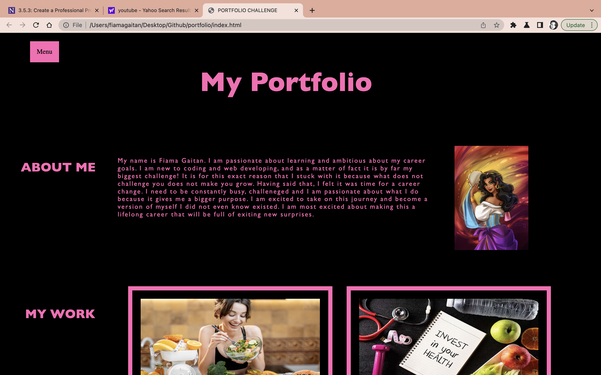
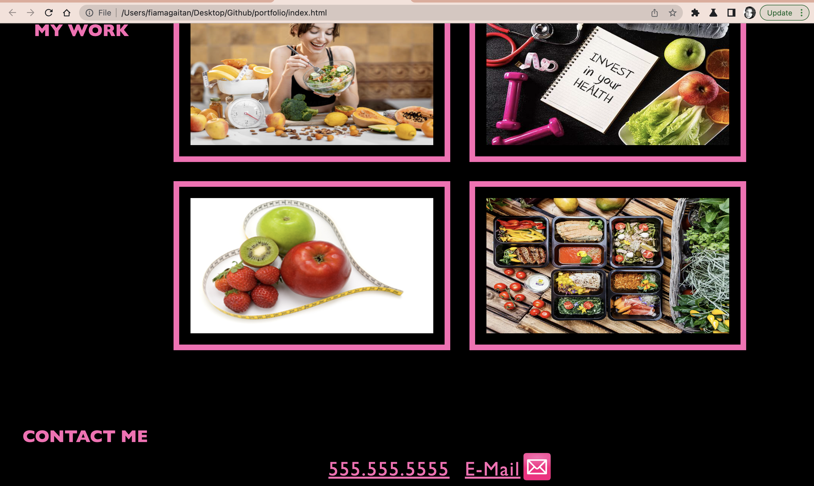

# <Portfolio>

## Description

The motivation for this project was to truly dive in and start creating our webpage. As simple as this may sound, it was nothing but that. The motivation was to try to accomplish this task and meet all the required criteria as much as possible following the concepts that we have learned throughout the week.
This project was built to put our knowledge to the test but most importantly it served as a great tool to get started and build a project from scratch- with no starter code. This project will come in handy in the future as well.
The problem it solves is to see how much understanding of concepts we have. I would say as of right now, there is not much to this point but I think in the future it will definitely serve a much bigger purpose once we put it together with actual project we create throughout the course of time.
I learned that building a website is a lot more intricate than it seems. From the previous project, I learned about semantic elements and I tried to implement those here. I learned and was primarily challenged cy Cascading Sheets Styles (CSS). Wow! truly challneging for me but it has given me a look into how we talk to our page and how our page responds to the commands given, how different elements make things easier or harder, and how it all comes together to make something out 0of nothing.

## Table of Contents (Optional)
N/A

## Installation

As of now, there is no big project to be installed. The webpage just had to be launched and that is it. In the future, there will be a project installation and I am yet to learn how that works.

GitHub was used to publish/launch the website.

## Usage

The usage of this website is simple. As of now it only serves to browse. In the future it will be a homepage to an application.

## Credits

"LEARN CSS IN 20 MINUTES" - Youtube Tutorial
[ https://youtu.be/1PnVor36_40 ]

"ADVANCED CSS STYLING IMAGES.." - Youtube Tutorial
[ https://youtu.be/TBl_XGy1xVc ]

"HOW TO USE AN IMAGE AS A LINK IN HTML" - Youtube Tutorial
[ https://youtu.be/D6aHo1VvCc8 ]

"HOW TO CREATE A LINK THAT OPENS A NEW BROWSER TAB"- Youtube Tutorial
[ https://youtu.be/9wSztUs2lZY ]

HTML AND CSS TUTORIALS - W3 SCHOOLS
https://www.w3schools.com/

## License

N/A
---

## Website Link

https://flgaitan.github.io/portfolio/
